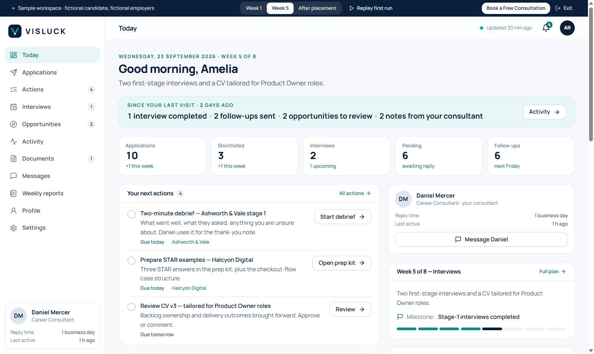
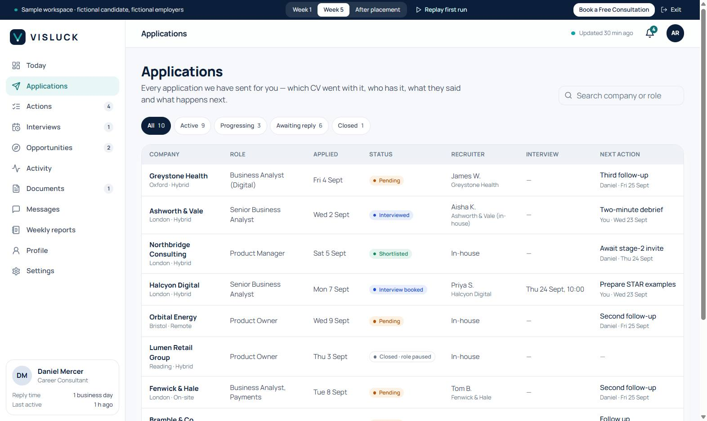
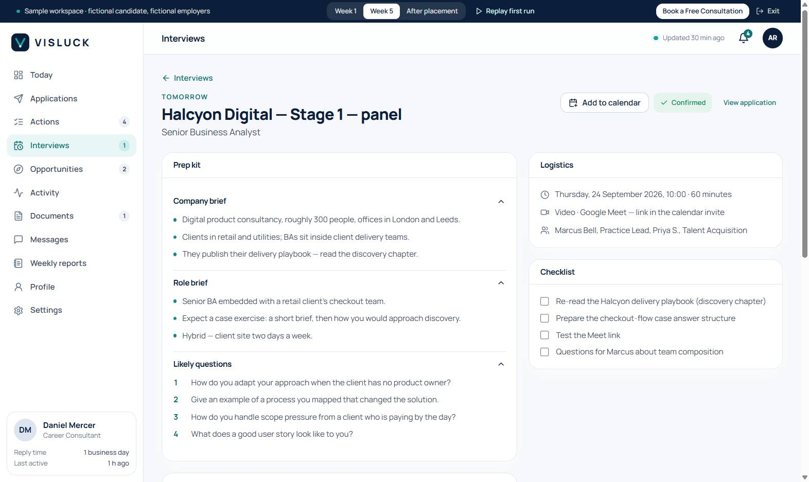
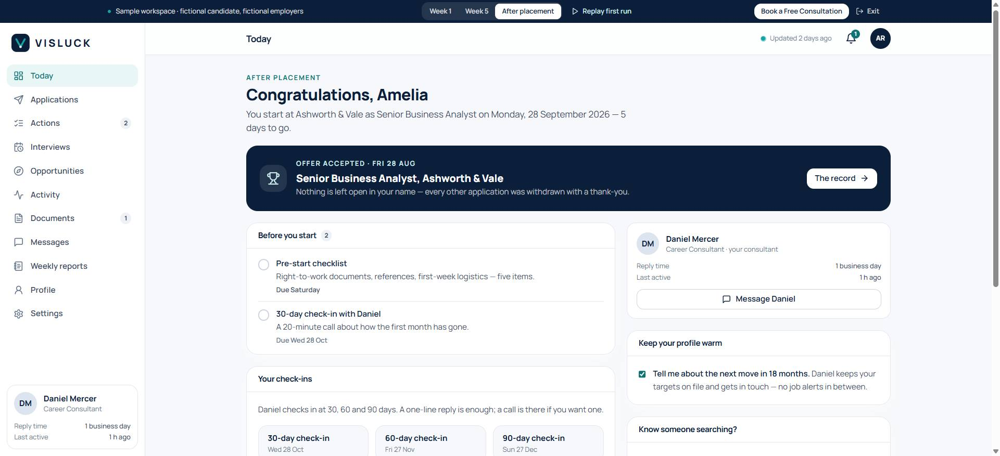
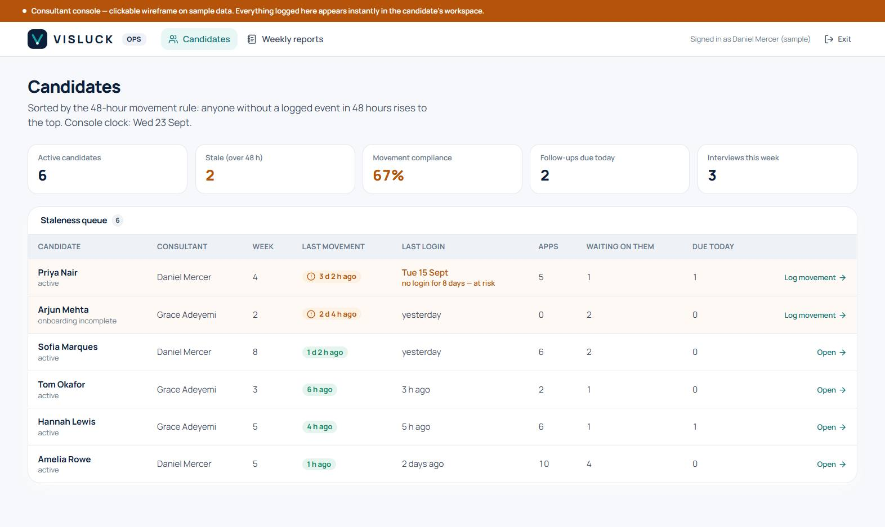
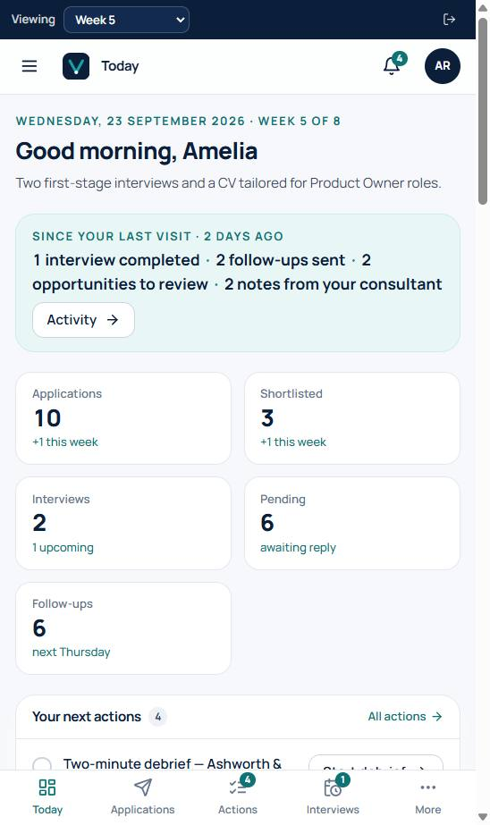

# VisLuck Candidate Workspace — product definition

*The product behind the login. Phase A (this repo): prototype + public demo on sample data. Phase B: the same screens on VisLuck's backend (see [docs/API.md](docs/API.md)).*

## 1. The promise

The marketing site makes three promises the product has to keep:

- Step 06 — *"Track Everything: your personalised dashboard keeps your job-search activity organised."*
- Philosophy — *"The candidate should always know what is happening with their job search."*
- FAQ — *"Clients receive access to their personalised VisLuck dashboard."*

**Logged-in promise, one sentence:** *A team is working your search — and you can see every move.*

| Pillar | What the product shows |
|---|---|
| Visibility | An append-only activity log of everything done for you, per application and overall |
| Momentum | Pipeline, weekly movement, dated next actions, a week-by-week search plan |
| A human | A named consultant with a face, a reply-time promise, and one thread |

Not "AI job search". The differentiator is human-managed + radical transparency + UK-specific. No dark patterns, no fake activity, no streaks or badges, no outcome promises — consistent with the site's Transparency section. Deliberately not built: job board or scraper, auto-apply bots, community feed, chatbot as primary support, gamification.

## 2. Retention, defined honestly

A managed job search is a finite-goal product — the candidate's success is leaving. We optimise for **trust per visit**, not time spent:

1. **During the search** — weekly return ≥ 85 %, because every visit shows movement.
2. **At the end** — they get placed, and the record proves the work that got them there.
3. **After** — they come back for the next move and bring friends.

One rule for every screen: **something always moved, and you always know what's next.** No screen is ever empty; an empty state says what happens next and by when.

### The loop

consultant does work → event logged → notification (right channel, right cadence) → candidate opens the workspace → sees *since your last visit* → completes a small action → consultant continues.

| Mechanic | Where it lives |
|---|---|
| Triggered returns | Instant notify for shortlist / interview / employer reply; daily digest 18:00; weekly report Monday 09:00 (Settings) |
| Earned return | The *Since your last visit* strip on Today — the single most important element |
| Reciprocal actions | Actions: approve a CV version, confirm a slot, three STAR answers, a two-minute debrief |
| Human presence | Consultant card everywhere (name, reply promise, last active), Messages thread |
| Momentum | KPIs, pipeline funnel, plan progress, milestones — progress, not points |
| Honest daily reason | Opportunities: roles under consideration, approve or decline with a reason |
| No-empty-state rule | Every empty state names the next event and its date |

### Ops rules the product enforces (the make-or-break)

The candidate's experience is exactly as good as the consultant's logging discipline, so the console makes the rules visible and cheap to follow:

- **48-hour movement rule** — every active candidate gets at least one logged consultant/employer event every 48 hours (even "followed up, awaiting reply"). The board sorts by staleness; the backend job notifies at 48 h and escalates at 72 h.
- **Monday 09:00 weekly report** — auto-drafted from the event log; the consultant edits and publishes.
- **1-business-day reply** on messages.
- **Logging takes ten seconds** — paste URL → fetch → log. Every quick-log schedules its own follow-up, so nothing is sent and forgotten.
- **Nothing sent without approval** in approve-first mode; every application records the CV version and statement used.

## 3. Metrics

| Metric | Target |
|---|---|
| Onboarding completed within 72 h of invite | ≥ 80 % |
| Weekly return during active search | ≥ 85 % (median 3 sessions/week) |
| Candidates with ≥ 1 event per 48 h | ≥ 95 % |
| Candidate actions completed by due date | ≥ 70 % |
| Consultant replies within 1 business day | ≥ 95 % |
| 90-day post-placement check-in response | ≥ 50 % |
| Referral rate / NPS | tracked from day one; NPS ≥ 50 |

Outcome numbers (placements, interview rates) stay internal until real and substantiated — same stance as the site.

## 4. Screens and their empty states

Routes are relative to the workspace base (`/demo` today, `/app` once sign-in exists). Copy below is what ships in Phase A.

| Screen | Route | Purpose | Empty state (week 1) |
|---|---|---|---|
| First run | `/start` | Welcome from the consultant → 5 steps (details · CV & LinkedIn · targets · availability · notifications) → *Your search plan* → Today | — (the flow itself) |
| Today | `/` | Since-last-visit strip · 5 KPIs · next 3 actions · opportunities for review · upcoming interviews · recent activity · consultant card · this week's plan · pipeline · milestones | "Interviews come after applications — first applications go out w/c *date* once you approve the roles." / "Nothing waiting for your approval — new opportunities usually appear within 48 hours." |
| Applications | `/applications` | The seven promised columns; filters; phone cards | "Applications begin once you approve the first roles. Nothing is sent without your OK." + *First applications w/c date* + link to Opportunities |
| Application detail | `/applications/:id` | Latest note, next step, interviews, full timeline, details (CV version used, recruiter, source, salary), stage history, *Ask Daniel* | "Nothing scheduled right now — Daniel is waiting on the employer and will log the next follow-up date here." |
| Activity | `/activity` | Everything, grouped by day, filterable; *New* markers since last visit | "The next update lands the moment Daniel logs it — at least one entry every 48 hours." |
| Actions | `/actions` | Open / Done; *On Daniel's list* alongside | "Nothing waiting on you — when Daniel needs something it appears here with a date." + Daniel's next due date |
| Interviews | `/interviews` | Upcoming / Completed cards, add-to-calendar (.ics) | "Interviews come after applications." or "*n* shortlisted — interviews usually follow within a week or two." |
| Interview detail | `/interviews/:id` | Confirm slot · prep kit (company, role, likely questions) · STAR bank · checklist · logistics · two-minute debrief · employer feedback | Debrief panel explains what appears after the interview |
| Opportunities | `/opportunities` | For your review (approve / decline with reason) · Decided | "Daniel is researching roles against your targets — new opportunities usually appear within 48 hours." |
| Documents | `/documents` | CV, supporting statements, LinkedIn — every version with its change note; approve / comment | Note explaining when LinkedIn copy and statement templates arrive |
| Messages | `/messages` | One thread; application-tagged messages; WhatsApp for urgent | Welcome message from the consultant is always present |
| Weekly reports | `/reports`, `/reports/:id` | Did / happened / next + numbers | "Your first report arrives on Monday" + date |
| Profile & preferences | `/profile` | Details (read-only) · targeting form · approval mode | — |
| Settings | `/settings` | Notifications (instant / digest / weekly; email / WhatsApp) · data export · deletion · leave | — |
| Search plan | `/plan` | Eight weeks, one focus and one milestone each, current week highlighted | — |
| After placement | `/` (status `placed`) | Countdown to start · pre-start checklist · 30/60/90-day check-ins · search in numbers · keep-profile-warm · referral · what stays available | — |

### Consultant console (wireframe, `/ops`)

| Screen | Flow |
|---|---|
| Candidates | Board sorted by staleness; tiles for active, stale, movement compliance, follow-ups due today, interviews this week; at-risk flag when no login for 7 days |
| Candidate detail | **Quick-log** (paste → fetch → log; auto-schedules the follow-up) · stage select with close reason · *Follow-up sent* / *Reply received* / *Interview* per row · **Schedule interview** (creates confirm + prep tasks) · **Assign task** · waiting-on-candidate list · your open follow-ups · recent activity |
| Weekly reports | Pick candidate → **Draft from this week's activity** → edit → **Publish to candidate** |

## 5. Architecture (Phase A → B)

- `client/src/workspace/data/types.ts` — the domain model and the contract with the backend.
- `client/src/workspace/data/derive.ts` — turns a snapshot into screen state *as of now*: stages, KPIs, funnel, since-last-visit, plan week, candidate status. Shared by demo, prototype and the real app.
- `client/src/workspace/data/provider.ts` — `WorkspaceData`, the only interface screens use. `mock/MockDataProvider.ts` today; `ApiDataProvider` in Phase B.
- `client/src/workspace/data/mock/journey.ts` — an eight-week fictional journey written as day offsets from a kick-off Monday, pinned to the real calendar so dates always look current. Three scenarios: week 1, week 5 (default), after placement.
- `client/src/workspace/ops/` — console wireframe on an in-memory `OpsStore` that appends the same events the backend will.
- Marketing site: *Log in* → `/app` (honest sign-in page until Phase B), *Try the dashboard* → `/demo` from the hero, the dashboard section and the tracking FAQ. `/app`, `/ops`, `/demo` are `noindex` and disallowed in `robots.txt`.

## 6. Phase B checklist (backend + frontend)

1. Backend implements [docs/API.md](docs/API.md) — schema from `types.ts`, event taxonomy, scheduled jobs.
2. `ApiDataProvider` (fetch + bearer token + ETag polling) behind the same interface; `/app` becomes the real workspace with magic-link sign-in.
3. Console on real data; lead intake from the Book-a-Call form; email notifications and the Monday report job.
4. PostHog EU (cookieless) events: login, since-last-visit view, task complete, report open.
5. Privacy policy updated with processors; export and deletion wired to the endpoints.
6. Go live with the first candidates; review the §3 metrics weekly.

## 7. Screens (Phase A build)

| | |
|---|---|
|  |  |
|  |  |
|  |  |
